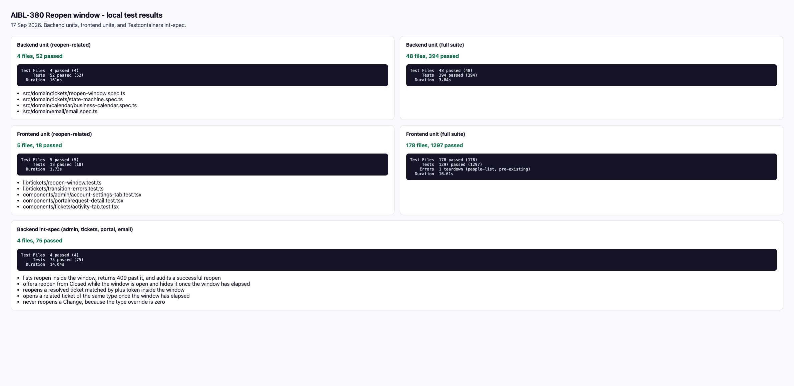
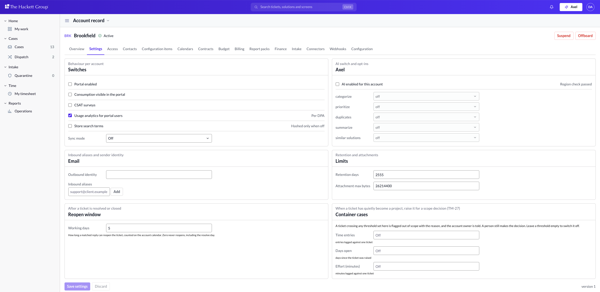
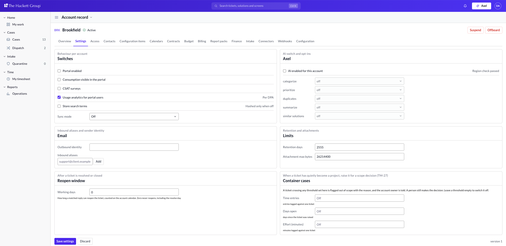
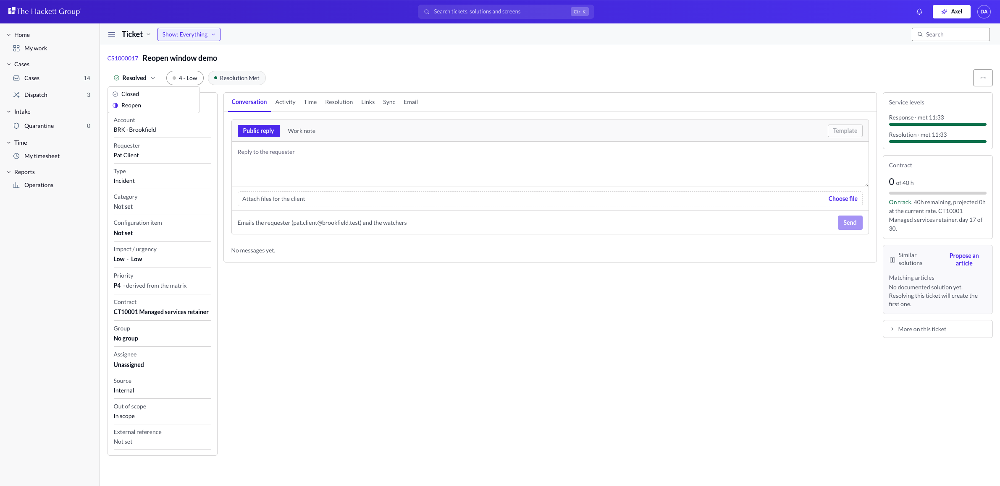
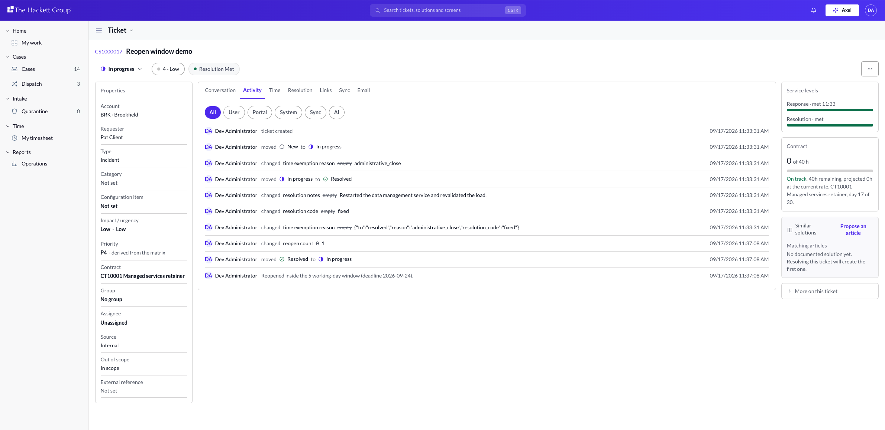
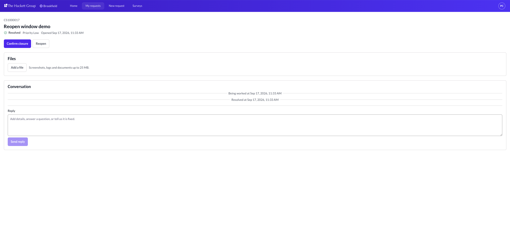
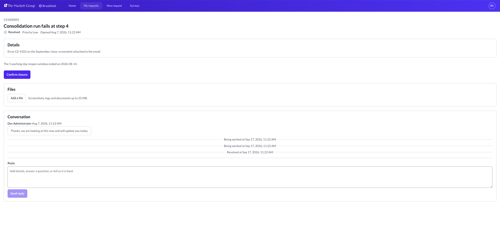

# AIBL-380 Reopen window: how to test locally

17 Sep 2026. Local stack on this machine: API `http://localhost:3001`, web `http://localhost:3000`, Postgres on port **5434** (5433 was already taken). Sign-in is `/dev/sign-in` with `NEXT_PUBLIC_AUTH_DEV_MODE=true`.

## What the automated tests proved



| Suite | Result |
| --- | --- |
| Backend unit (reopen-related) | 4 files, **52 passed** |
| Backend unit (full) | 48 files, **394 passed** |
| Frontend unit (reopen-related) | 5 files, **18 passed** |
| Frontend unit (full) | 178 files, **1297 passed** (1 pre-existing jsdom teardown in `people-list.test.tsx`) |
| Backend int-spec (`admin`, `tickets`, `portal`, `email`) | 4 files, **75 passed** |

Int-spec cases that cover the ticket:

- lists reopen inside the window, returns 409 past it, and audits a successful reopen
- offers reopen from Closed while the window is open and hides it once the window has elapsed
- reopens a resolved ticket matched by plus token inside the window (`reply inside reopen window`)
- opens a related ticket of the same type once the window has elapsed (comment names the old key and why)
- never reopens a Change, because the type override is zero
- appends to a cancelled ticket and does not reopen it
- reopens a plus-token reply on working day 3
- spawns a related ticket on calendar day 8
- reopens on calendar day 8 when a holiday sat inside the window, and spawns the day after

Commands (from the repo roots; `pnpm test` currently trips `ERR_PNPM_IGNORED_BUILDS`, so call Vitest directly):

```bash
# backend
./node_modules/.bin/vitest run
./node_modules/.bin/vitest run --config ./vitest.config.integration.ts \
  test/admin.int-spec.ts test/tickets.int-spec.ts test/portal.int-spec.ts test/email.int-spec.ts

# frontend
./node_modules/.bin/vitest run
```

## Manual UI path

Seeded tickets that were resolved weeks ago already sit **outside** the window (for example CS1000005, deadline 2026-08-14). To see Reopen, resolve a ticket today (this run used CS1000017 "Reopen window demo").

### 1. Account setting (desk)

Sign in as **Dev Administrator**. Open Brookfield, **Settings**.

The **Reopen window** panel is under Limits. Default is **5** working days. Zero never reopens, including the resolve day.



Change Working days to **0**. Save settings becomes enabled. Discard unless you really want never-reopen on this account.



### 2. Desk: Reopen while the window is open

Open a ticket resolved **today**. Click the **Resolved** state pill. The menu offers **Closed** and **Reopen**.



After Reopen, **Activity** shows the dedicated audit line:

`Reopened inside the 5 working-day window (deadline 2026-09-24).`



A seeded ticket whose window has elapsed (CS1000005) only offers **Closed**. The 409 toast for a forced reopen is `Window closed` with the deadline sentence.

### 3. Portal: Reopen vs elapsed copy

Sign in as **Pat Client · Brookfield**, then open `/portal/requests/<key>`.

Inside the window (CS1000017): **Confirm closure** and **Reopen**.



Past the window (CS1000005): Reopen is gone. The sentence is:

`The 5 working-day reopen window ended on 2026-08-14.`



### 4. Inbound email (no UI)

Covered by int-spec, not the browser:

- Plus-token match inside the window reopens the same ticket.
- Subject-key match after the window creates a **related** ticket of the same type with a comment `Follow-up to <old key>`.
- Change type override is 0, so a completed change always spawns related, never reopens.

## Notes from this run

- Port 5433 was `certify-postgres`, so local XMS Postgres is `xms-postgres-aibl380` on **5434**. Backend `.env` points there; frontend `.env.local` has `NEXT_PUBLIC_AUTH_DEV_MODE=true`.
- The first int-spec pass failed until portal reads of `reopen_window_business_days` were column-granted (migration 0058) and fixture updates wrote an audit row in the same transaction.
- Next.js printed a hydration overlay on `/dev/sign-in`; it is unrelated to the reopen panel. Dismiss with Escape.
